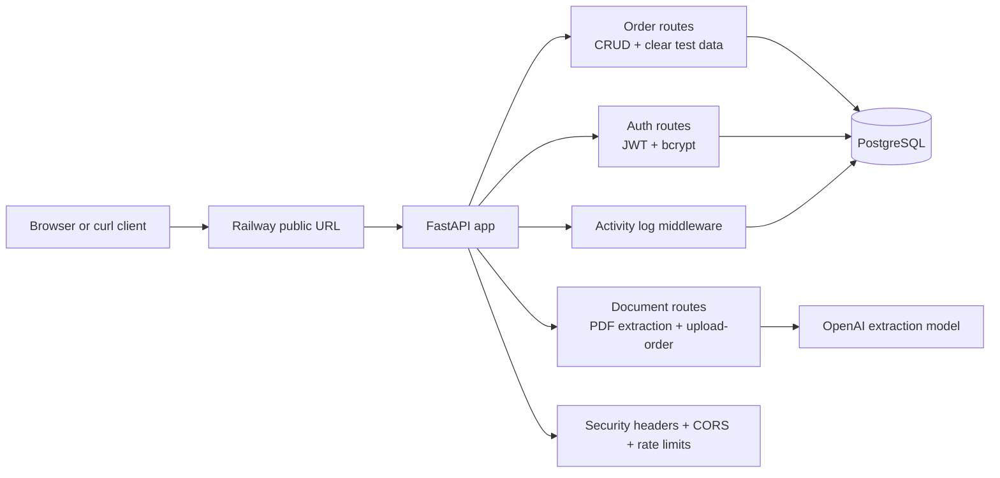

# Uploaded Documents Extractor

REST API and small React frontend for creating and managing patient orders from uploaded PDF documents. The API extracts a patient's first name, last name, and date of birth from a PDF, persists an order to PostgreSQL, and logs request activity.

Deployed app:

```text
https://uploaded-documents-extractor-production.up.railway.app
```

Demo login:

```text
Email: admin@example.com
Password: provided in the submission email
```

Do not include `.env`, OpenAI API keys, or production secrets in source control.

## Features

- Python/FastAPI REST API with versioned `/api/v1` endpoints.
- Order CRUD with PostgreSQL persistence.
- PDF upload endpoint that extracts patient information and creates an order.
- Duplicate upload protection for the same user, extracted patient, DOB, and filename.
- JWT authentication with bcrypt password hashing.
- User-scoped authorization for order read/update/delete.
- Activity logging middleware persisted to the database.
- Rate limiting on auth and document extraction endpoints.
- Security headers, CORS restrictions, API `Cache-Control: no-store`, and sanitized uploaded filenames.
- React/TypeScript frontend for login, upload, list, edit, delete, and clearing test orders.
- Docker/Railway deployment support.

## Architecture



## Project Structure

```text
app/
  api/v1/routes/       FastAPI route handlers
  core/                config, auth helpers, rate limiter, logging
  db/                  SQLAlchemy base, session, models
  middleware/          activity logging and security headers
  repositories/        database access functions
  schemas/             Pydantic request/response models
  services/            business logic and document extraction
frontend/              React + TypeScript + Vite UI
migrations/            Alembic database migrations
tests/                 unit, integration, and extraction eval tests
Dockerfile             production image builds frontend + API
compose.yml            local Postgres and test Postgres
railway.toml           Railway deployment config
```

## API Endpoints

Authentication:

- `POST /api/v1/auth/token` - OAuth2 password login, returns bearer token.

Health:

- `GET /api/v1/health` - public health check.

Orders:

- `GET /api/v1/orders` - list current user's orders.
- `POST /api/v1/orders` - manually create an order.
- `GET /api/v1/orders/{order_id}` - get one order.
- `PATCH /api/v1/orders/{order_id}` - update patient fields, status, or notes.
- `DELETE /api/v1/orders/{order_id}` - delete one order.
- `DELETE /api/v1/orders` - clear all orders for the current user; useful for repeat testing.

Documents:

- `POST /api/v1/documents/extract` - extract patient fields only.
- `POST /api/v1/documents/upload-order` - extract patient fields and create an order.

In production, interactive API docs are disabled. In non-production environments, FastAPI docs are available at `/api/docs`.

## Manual API Smoke Test

Run these commands from the project root (`uploaded-documents-extractor/`) so the sample PDF path resolves. These examples use fish shell syntax.

```fish
cd /path/to/uploaded-documents-extractor

set BASE_URL "https://uploaded-documents-extractor-production.up.railway.app"
set EMAIL "admin@example.com"
set PASSWORD "<password-provided-in-submission-email>"
set PDF "DME Patient Demo Document CPAP.fax.pdf"
```

If the sample PDF is not present locally, download the assignment sample PDF and save it with the filename above.

Health check:

```fish
curl -i "$BASE_URL/api/v1/health"
```

Expected: `200 OK`.

Login:

```fish
set TOKEN (curl -s -X POST "$BASE_URL/api/v1/auth/token" \
  -H "Content-Type: application/x-www-form-urlencoded" \
  -d "username=$EMAIL&password=$PASSWORD" \
  | python3 -c "import sys,json; print(json.load(sys.stdin)['access_token'])")

echo $TOKEN
```

Expected: a JWT token is printed.

Clear existing test orders:

```fish
curl -i -X DELETE "$BASE_URL/api/v1/orders" \
  -H "Authorization: Bearer $TOKEN"
```

Expected: `204 No Content`.

Upload a PDF and create an order:

```fish
curl -i -X POST "$BASE_URL/api/v1/documents/upload-order" \
  -H "Authorization: Bearer $TOKEN" \
  -F "file=@$PDF;type=application/pdf"
```

Expected: `201 Created` with extracted patient fields and an order ID.

Confirm the order was persisted:

```fish
curl -s "$BASE_URL/api/v1/orders" \
  -H "Authorization: Bearer $TOKEN" | python3 -m json.tool
```

Expected: `total` is `1`.

Reupload the same PDF:

```fish
curl -i -X POST "$BASE_URL/api/v1/documents/upload-order" \
  -H "Authorization: Bearer $TOKEN" \
  -F "file=@$PDF;type=application/pdf"
```

Expected: `200 OK` with the existing order, not a duplicate `201 Created`.

Update an order:

```fish
set ORDER_ID (curl -s "$BASE_URL/api/v1/orders" \
  -H "Authorization: Bearer $TOKEN" \
  | python3 -c "import sys,json; print(json.load(sys.stdin)['items'][0]['id'])")

curl -i -X PATCH "$BASE_URL/api/v1/orders/$ORDER_ID" \
  -H "Authorization: Bearer $TOKEN" \
  -H "Content-Type: application/json" \
  -d '{"status":"completed","notes":"Manual API smoke test"}'
```

Expected: `200 OK` and `status` is `completed`.

Delete the order:

```fish
curl -i -X DELETE "$BASE_URL/api/v1/orders/$ORDER_ID" \
  -H "Authorization: Bearer $TOKEN"
```

Expected: `204 No Content`.

## Manual UI Test

1. Open the deployed URL in a browser.
2. Log in with the demo credentials.
3. Click **Orders** and use **Clear Orders** to reset test data.
4. Click **Upload** and upload `DME Patient Demo Document CPAP.fax.pdf`.
5. Confirm an order is created and appears in the orders list.
6. Upload the same document again and confirm it does not create a duplicate order.
7. Edit the order status to `Completed` and save.
8. Delete the order.
9. Sign out and confirm protected pages require login.

## Local Development

Create `.env` from the example and fill in real secrets:

```bash
cp .env.example .env
```

Start local PostgreSQL:

```bash
docker compose up -d db
```

Install Python dependencies and run migrations:

```bash
python3 -m venv .venv
source .venv/bin/activate
pip install -r requirements.txt
alembic upgrade head
```

Run the API:

```bash
uvicorn app.main:app --reload
```

Run the frontend in development mode:

```bash
cd frontend
npm install
npm run dev
```

The Vite dev server runs on `http://localhost:5173` and proxies `/api` requests to `http://localhost:8000`.

## Tests

Start the test database:

```bash
docker compose up -d db_test
```

Run fast unit and integration tests without LLM evals:

```bash
.venv/bin/python -m pytest -m "not eval" -q
```

Run the frontend build:

```bash
cd frontend
npm run build
```

The extraction eval tests marked `eval` require a valid `OPENAI_API_KEY` and the sample PDF.

## Deployment

The app is deployed on Railway using the included `Dockerfile` and `railway.toml`.

The production image:

1. Builds the React frontend.
2. Installs Python dependencies.
3. Runs Alembic migrations on startup.
4. Starts Uvicorn on Railway's provided `PORT`.
5. Serves the built frontend from FastAPI when `frontend/dist` exists.

Required production environment variables:

- `DATABASE_URL`
- `SECRET_KEY`
- `OPENAI_API_KEY`
- `OPENAI_MODEL`
- `ADMIN_EMAIL`
- `ADMIN_PASSWORD`
- `ALLOWED_ORIGINS`
- `ENVIRONMENT=production`

## Tradeoffs

- A seeded admin user is used instead of full user registration because the assignment focuses on API functionality and deployment.
- PDF files are not permanently stored. The app stores extracted patient fields and the original filename for audit context.
- Document extraction runs synchronously in the request. A queue/background worker would be better for high volume, but synchronous processing keeps the MVP simple and easy to verify.
- Rate limiting and caching use in-process memory. This is acceptable for a small single-instance MVP, but Redis would be preferred for multi-instance scaling.
- Duplicate upload prevention is based on user, extracted patient name, DOB, and filename. A content hash would be stronger if file storage or raw file hashing were added.

## Limitations

- Extraction depends on OpenAI API availability and model behavior.
- Scanned PDF support renders up to the first three pages for vision extraction.
- No role management UI beyond the seeded admin.
- No batch upload endpoint.
- No permanent document storage or document download endpoint.
- Production API docs are disabled; use this README or non-production `/api/docs` for endpoint details.
